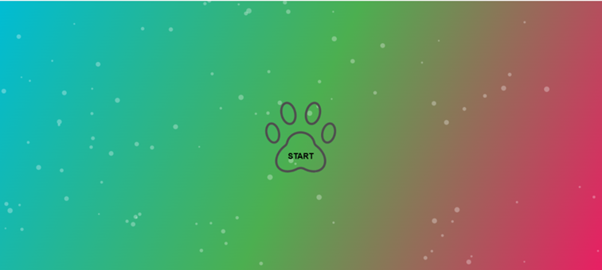
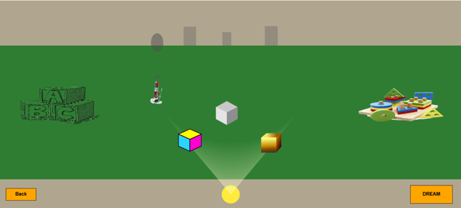
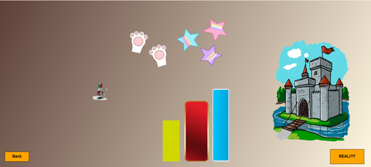

# JavaScriptOyunProjesi

# 🎮 MY SHADOWS ARE BRIGHT

Bu proje, [My Shadows Are Bright] (https://buday.itch.io/my-shadows-are-bright) adlı oyundan esinlenilerek geliştirilmiştir.  
HTML5 ve JavaScript kullanılarak Canvas üzerinden tasarlanmış 2D bir deneyim sunar.

## 🔗 Oyun Bağlantısı

👉 [Oyunu Oyna] (https://aynur-ad.github.io/JavaScriptOyunProjesi/)

👉 [Oyunu Nasıl Oynayacağım?] (https://www.youtube.com/watch?v=OWjYjmiIYQo)

---

## 🧩 Oyun Özeti

Oyuncular, oyuncak bir asker ve renkli küpleri kullanarak duvarda gölgeler oluşturur. Bu gölgeler bir anlamda ipucu niteliğindedir; çünkü sonrasında girilen hayal dünyasında bu gölgelerle temsil edilen engellerin arasından geçip kaleye ulaşmak gerekir.
Orijinal oyun 3D bir yapıya sahipken, bu projede tüm öğeler 2D olarak yeniden tasarlanmıştır. Bu nedenle bazı dinamikler (örneğin gölgelerin engelleri doğrudan etkilemesi) tam olarak uygulanamamıştır.
Bu oyunda gölgeler oluşturulabilir fakat gölgeler değişse bile engeller sabittir. Oyuncular, hayal dünyasında oyuncak asker karakterini oradaki engellere değmeden kaleye ulaştırmaya çalışırlar.

---
## 🚀 Nasıl Oynanır?

- Oyun İçi Görseller:

- Oyun Dünyası'nda; oyuncak asker ve küpler mouse ile hareket ettirilir.

- Hayal Dünyası'nda oyuncak asker ok tuşları ile hareket ettirilir.

---

## 🧪 Test

Proje görsel tabanlı ve etkileşimli bir oyun olduğundan klasik anlamda bir test altyapısı bulunmamaktadır. Ancak oyun tüm modern tarayıcılarda (Chrome, Firefox vb.) çalışacak şekilde test edilmiştir.

---

## 🔧 Kullanılan Teknolojiler

- **HTML5 Canvas**
- **JavaScript**
- Görseller & sesler için açık kaynak varlıklar kullanılmıştır ve linkleri en altta verilmiştir.

---
## 🔮 Geliştirme Notları

- Oyun 2D olarak tasarlandığı için, 3D versiyonundaki gölge-engel dinamiği tam olarak yansıtılamamıştır.
- Gelecekte, gölgelerin şekline göre engellerin gerçek zamanlı olarak değiştiği bir yapı düşünülmektedir.

---
## 👩‍💻 Geliştirici

**Aynur Adıbelli**

---
## 📦 Asset ve Ses Kaynakları

### 🎵 Sesler:

- **Hareket Sesi**  
  [Pixabay- Finger Snap Without Reverb] (https://pixabay.com/tr/sound-effects/sound-effects-finger-snap-without-reverb-113862/)

- **Geçiş Sesi**  
  [Pixabay- Swoosh Sound Effect] (https://pixabay.com/tr/sound-effects/swoosh-sound-effect-for-fight-scenes-or-transitions-2-149890/)

- **Arka Plan Müziği**  
  - [AudioTrimmer- Telifsiz Müzik] (https://audiotrimmer.com/tr/telifsiz-muzik/)  
  - [Feeling Good (Direct MP3)] (https://storage.de.cloud.ovh.net/v1/AUTH_62249012557840c2bc95261c7077a80d/at/Feeling-Good.mp3)

### Assets:

- **Renkli Küp**
  [Pixabay](https://pixabay.com/tr/vectors/k%C3%BCp-nesneler-kutular-sar%C4%B1-pembe-42317/)  

- **Gri Küp**: 
  [Klipartz](https://www.klipartz.com/tr/sticker-png-bltxi)  

- **Sarı Küp**
  [Eğitim Grafik] (https://egitimgrafik.com/kup-png-resmi-2/)  

- **Oyuncak Asker** 
  [PNGTree](https://png.pngtree.com/png-vector/20230808/ourmid/pngtree-toy-soldier-vector-png-image_6881166.png)    

---
### 🖼️ Görseller:

- **Çizgi Stilinde Pati Simgesi**  
  [DepositPhotos](https://depositphotos.com/tr/vector/paw-line-icon-pad-vector-illustration-isolated-on-white-foot-outline-style-design-designed-for-375131874.html)  

- **Oyuncak Blok**  
  [PNGWing](https://www.pngwing.com/tr/free-png-ijime)  

- **Oyuncak Yapboz**  
  [PNGWing](https://w7.pngwing.com/pngs/550/954/png-transparent-educational-toys-jigsaw-puzzles-child-gift-toy-child-photography-toddler-thumbnail.png)  

- **Pembe Pati İzi (Cat Paw)**    
  [PNGTree](https://tr.pngtree.com/freepng/pink-cat-paw-paw_5413274.html)  

- **Yıldız**  
  [Klipartz](https://www.klipartz.com/tr/sticker-png-qmrcu#google_vignette)  

- **Kale (Castle)**  
  [PNGWing](https://w7.pngwing.com/pngs/281/480/png-transparent-cartoon-drawing-castle-princess-building-photography-world.png)  

- **Sarı Dikdörtgen**  
  [PNGEgg](https://www.pngegg.com/tr/png-esmtv)  

- **Mavi Dikdörtgen**  
  [PNGDownload](https://www.pngdownload.id/png-jx4kj3/)  

- **Kırmızı Dikdörtgen**  
  [PNGEgg](https://www.pngegg.com/tr/search?q=dikd%C3%B6rtgen)  

---

Bu proje tamamen bireysel öğrenim amacıyla geliştirilmiştir.
